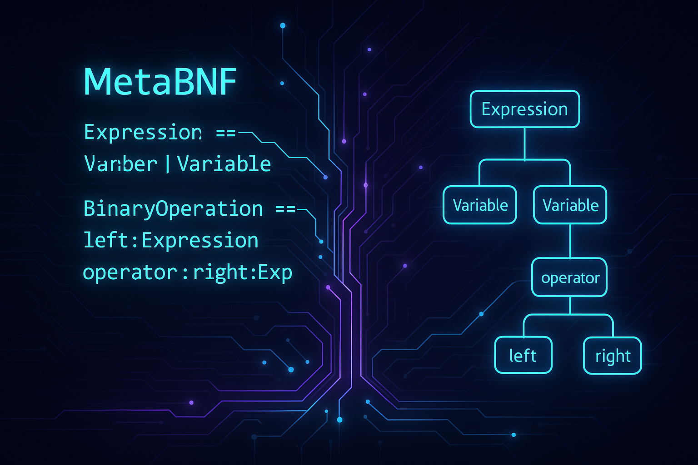

# MetaBNF: A Meta-Language for Defining MPS DSLs

🚀 **MetaBNF** is a language designed in **JetBrains MPS** that allows developers to **describe and generate domain-specific languages (DSLs)** using an extended **Backus-Naur Form (BNF)** notation.



With MetaBNF, you can **define a DSL** in a familiar grammar-like syntax and **automatically generate MPS Concepts, Editors, and Language Components**.

---

## ✨ Features

✅ Define languages using **BNF-style notation**\
✅ Generate MPS **Concepts, Properties, References, and Editors**\
✅ Extend with **custom annotations** for additional MPS features\
✅ Automate language creation inside **JetBrains MPS**

---

## 📖 Example: Defining a DSL in MetaBNF

A simple expression language using MetaBNF:

```bnf
// Root Node with Child of 0..n
< WorkBook  > ::= { BNFStatements } ;

// Abstract Concept definition         
<< **BNFStatements** >> ::= <no expr>   
                                     
// extends BNFStatements             
< EmptyLine (A) > ::= <no expr> ;    
                                     
// Interface definition with an optional Child
<I `IBNFBaseStatement`  I>             
  ::= [ BNFExpression as expr ] ;    
                                     
<< BNFExpression  >> ::= <no expr>   
```

🔥 **This MetaBNF definition will generate:**\
✔️ `Expression`, `BinaryOperation`, `Number`, and `Variable` as **MPS Concepts**\
✔️ `Operator` as an **MPS Enumeration**\
✔️ Structure-aware **editors** inside MPS

---

## 🛠 Installation & Setup

### 1️⃣ Prerequisites

- JetBrains **MPS 2023.2.2 or newer**
- Java **17+**
- (Optional) Git for cloning the repo
- mbeddr.core available due to some dependencies

### 2️⃣ Clone the Repo & Import into MPS

```bash
git clone https://github.com/porscheofficial/MetaBNF.git
cd MetaBNF
```

- Open **JetBrains MPS**
- Import the project via **File → Open Project**

### 3️⃣ Try It Out!

1. Create a new MPS **Solution**
2. Add a new model and use the **MetaBNF editor**
3. Define a simple grammar and run the **generator**
4. Use the generated language inside MPS! 🚀

---

## 📚 Documentation & Roadmap

🚧 *We're actively developing MetaBNF!* Future updates will include:

- **MPS UI Integration**
- **Custom Syntax Extensions**
- **Improved Error Checking & Validation**

Check out our [Wiki](https://github.com/porscheofficial/MetaBNF/wiki) for more details!

---

## 🤝 Contributing

We welcome contributions! Here's how you can help:\
✅ **Submit issues** for bugs or feature requests\
✅ **Fork & create pull requests** with improvements\
✅ **Join the discussion** in our community

🔗 **Check out our** [**Contribution Guide**](CONTRIBUTING.md)

---

## 📜 License

MetaBNF is **open-source** under the [Apache 2.0](LICENSE).

